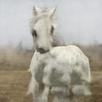
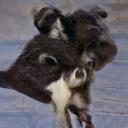
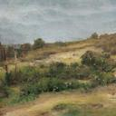
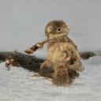
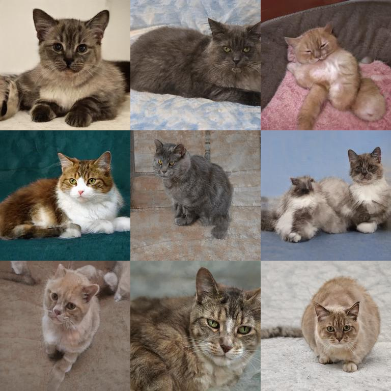
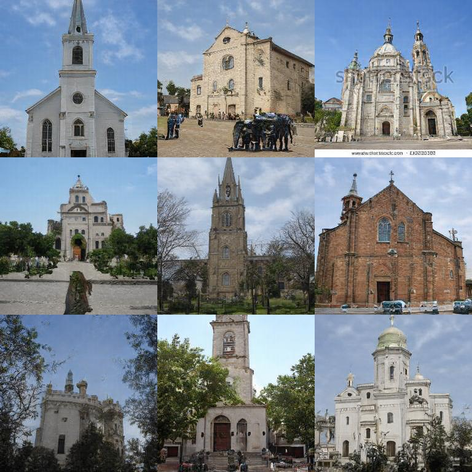
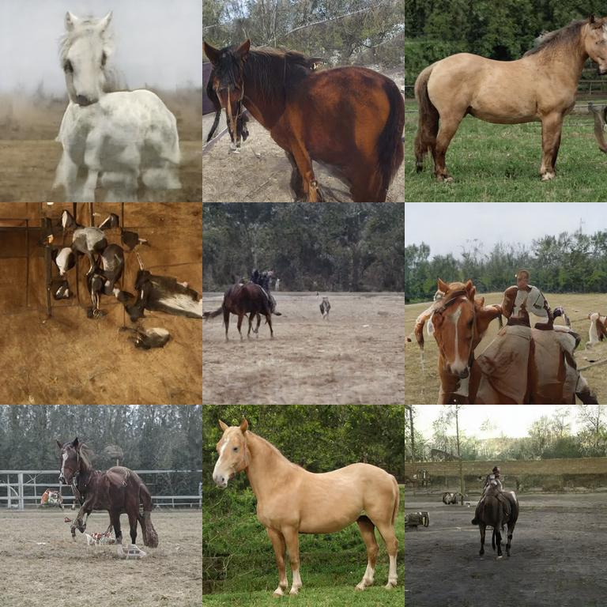
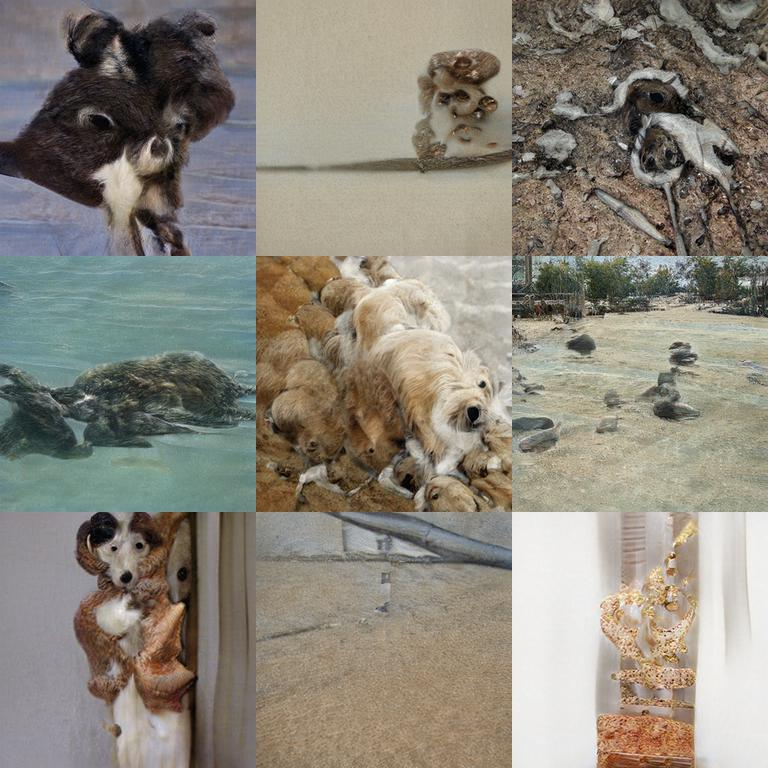
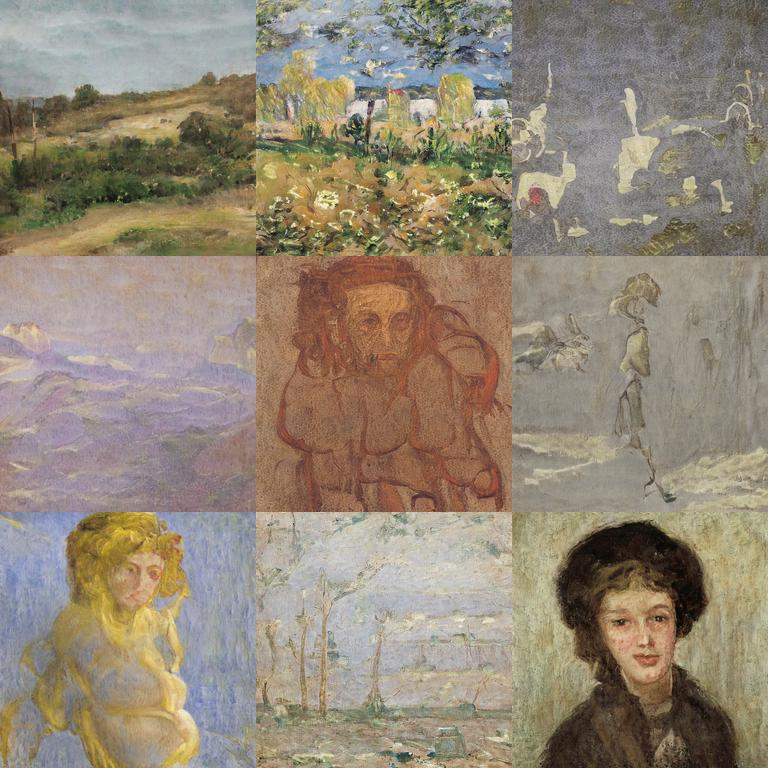
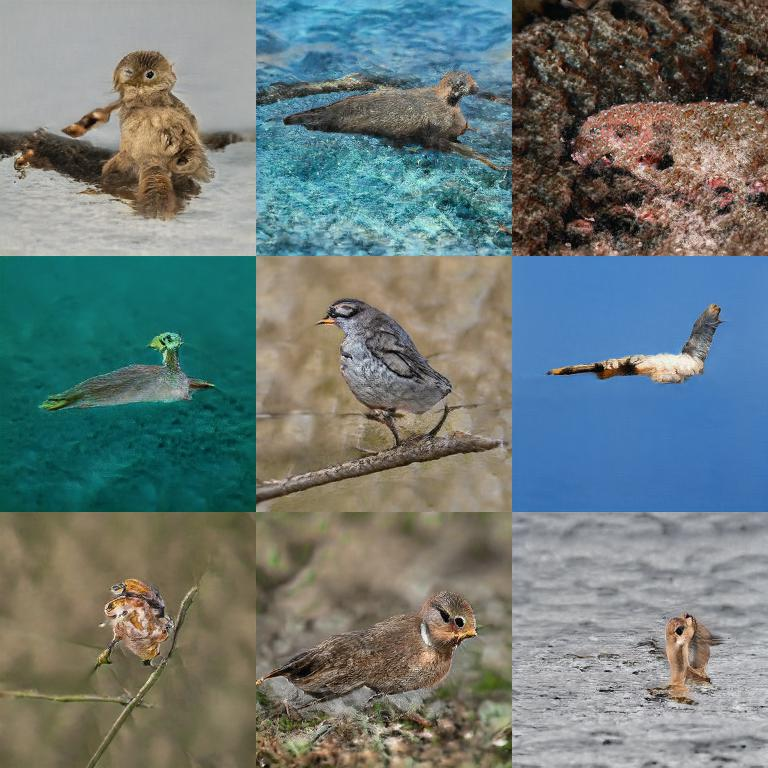

# Awesome Pretrained StyleGAN2

A collection of pre-trained [StyleGAN2](https://github.com/NVlabs/stylegan2) models trained on different datasets at different resolution.

_See [this repo](https://github.com/justinpinkney/awesome-pretrained-stylegan) for pretrained models for StyleGAN 1_

[.jpg)](#car-(config-e))
[.jpg)](#car-(config-f))

[.jpg)](#FFHQ-(config-e))
[.jpg)](#FFHQ-(config-f))

If you have a publically accessible model which you know of, or would like to share please see the [contributing](#contributing) section. _Hint: the simplest way to submit a model is to fill in this [form](https://forms.gle/PE1iiTa5tNTdBFYN9)._

### Table of Contents

- Models

    - [car (config-e)](#car-(config-e))
    - [car (config-f)](#car-(config-f))
    - [cat](#cat)
    - [church](#church)
    - [FFHQ (config-e)](#FFHQ-(config-e))
    - [FFHQ (config-f)](#FFHQ-(config-f))
    - [horse](#horse)
    - [Imagenet](#Imagenet)
    - [WikiArt](#WikiArt)
    - [Anime portraits](#Anime-portraits)
    - [microscope images](#microscope-images)
    - [wildlife](#wildlife)
    - [modern art](#modern-art)
- [Contributing](#contributing)

## car (config-e)

.jpg)
- Dataset: LSUN Cat
- Resolution: 512x384 config: e
- Author: [NVIDIA]()
- [Download link](http://d36zk2xti64re0.cloudfront.net/stylegan2/networks/stylegan2-car-config-e.pkl)
- StyleGAN2 implementation: https://github.com/NVlabs/stylegan2
- Licence: Nvidia Source Code License-NCNvidia Source Code License-NC
- [Source](https://github.com/NVlabs/stylegan2)

## car (config-f)

.jpg)
- Dataset: LSUN Cat
- Resolution: 512x384 config: f
- Author: [NVIDIA]()
- [Download link](http://d36zk2xti64re0.cloudfront.net/stylegan2/networks/stylegan2-car-config-f.pkl)
- StyleGAN2 implementation: https://github.com/NVlabs/stylegan2
- Licence: Nvidia Source Code License-NC
- [Source](https://github.com/NVlabs/stylegan2)

## cat

- Dataset: LSUN Cat
- Resolution: 256x256 config: f
- Author: [NVIDIA]()
- [Download link](http://d36zk2xti64re0.cloudfront.net/stylegan2/networks/stylegan2-cat-config-f.pkl)
- StyleGAN2 implementation: https://github.com/NVlabs/stylegan2
- Licence: Nvidia Source Code License-NC
- [Source](https://github.com/NVlabs/stylegan2)

## church

- Dataset: LSUN Church
- Resolution: 256x256 config: f
- Author: [NVIDIA]()
- [Download link](http://d36zk2xti64re0.cloudfront.net/stylegan2/networks/stylegan2-church-config-f.pkl)
- StyleGAN2 implementation: https://github.com/NVlabs/stylegan2
- Licence: Nvidia Source Code License-NC
- [Source](https://github.com/NVlabs/stylegan2)

## FFHQ (config-e)

.jpg)
- Dataset: FFHQ
- Resolution: 1024x1024 config: e
- Author: [NVIDIA]()
- [Download link](http://d36zk2xti64re0.cloudfront.net/stylegan2/networks/stylegan2-ffhq-config-e.pkl)
- StyleGAN2 implementation: https://github.com/NVlabs/stylegan2
- Licence: Nvidia Source Code License-NC
- [Source](https://github.com/NVlabs/stylegan2)

## FFHQ (config-f)

.jpg)
- Dataset: FFHQ
- Resolution: 1024x1024 config: f
- Author: [NVIDIA]()
- [Download link](http://d36zk2xti64re0.cloudfront.net/stylegan2/networks/stylegan2-ffhq-config-f.pkl)
- StyleGAN2 implementation: https://github.com/NVlabs/stylegan2
- Licence: Nvidia Source Code License-NC
- [Source](https://github.com/NVlabs/stylegan2)

## horse

- Dataset: LSUN Horse
- Resolution: 256x256 config: f
- Author: [NVIDIA]()
- [Download link](http://d36zk2xti64re0.cloudfront.net/stylegan2/networks/stylegan2-horse-config-f.pkl)
- StyleGAN2 implementation: https://github.com/NVlabs/stylegan2
- Licence: Nvidia Source Code License-NC
- [Source](https://github.com/NVlabs/stylegan2)

## Imagenet

- Dataset: Image net
- Resolution: 512x512 config: Unknown
- Author: [Shawn Presser]()
- [Download link](https://battle.shawwn.com/sdc/stylegan2-imagenet-512/model.ckpt-533504.pkl)
- StyleGAN2 implementation: Unknown- Notes: Trained using TPUs
- Licence: Unknown
- [Source](https://twitter.com/theshawwn/status/1244081581347598341)

## WikiArt

- Dataset: WikiArt
- Resolution: Unknown config: Unknown
- Author: [Peter Baylies](https://twitter.com/pbaylies)
- [Download link](https://archive.org/download/wikiart-stylegan2-conditional-model/network-snapshot-012052.pkl)
- StyleGAN2 implementation: https://github.com/pbaylies/stylegan2- Notes: Conditional
- Licence: Unknown
- [Source]()

## Anime portraits

- Dataset: Danboru
- Resolution: 512x512 config: f
- Author: [Aaron Gokaslan](https://skylion007.github.io/)
- [Download link](https://mega.nz/#!PeIi2ayb!xoRtjTXyXuvgDxSsSMn-cOh-Zux9493zqdxwVMaAzp4)
- StyleGAN2 implementation: Unknown
- Licence: Unknown
- [Source](https://www.gwern.net/Faces#stylegan-2)

## microscope images

- Dataset: Unknown
- Resolution: 1024x1024 config: Unknown
- Author: [Michael Friesen](https://twitter.com/MichaelFriese10)
- [Download link](https://mega.nz/#!PbgzWTZT!JbVpqgMU7AOg-sQUoG1BDepuwKtgAsLgjd4YwlTXlpc)
- StyleGAN2 implementation: Unknown
- Licence: Unknown
- [Source](https://twitter.com/MichaelFriese10/status/1230906267960401920?s=20)

## wildlife

- Dataset: Unknown
- Resolution: Unknown config: Unknown
- Author: [Michael Friesen](https://twitter.com/MichaelFriese10)
- [Download link](https://mega.nz/#!rewlECYI!YxVxdCKoeauEbiPKt92otVVHZBOiI-KkZMr0cvKHBdg)
- StyleGAN2 implementation: Unknown
- Licence: Unknown
- [Source](https://twitter.com/MichaelFriese10/status/1215364932088123392?s=20)

## modern art

- Dataset: Unknown
- Resolution: Unknown config: Unknown
- Author: [Michael Friesen](https://twitter.com/MichaelFriese10)
- [Download link](https://mega.nz/#!TCgSVCTa!ZmcV381soxyqiQyHO4p60F5ogoHcaO1PqDF9ZuiHVQw)
- StyleGAN2 implementation: Unknown
- Licence: Unknown
- [Source](https://twitter.com/MichaelFriese10/status/1213697331427545088?s=20)

## Contributing

__TLDR: You can either edit the [models.csv](models.csv) file or fill out this [form](https://forms.gle/PE1iiTa5tNTdBFYN9).__

This readme is automatically generated using Jinja, please do not try and edit it directly. Information about the models is stored in `models.csv` please add your model to this file. Preview images are generated automatically and the process is used to test the link so please only edit the csv file.