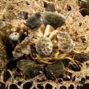
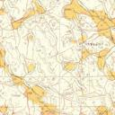
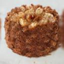
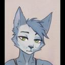
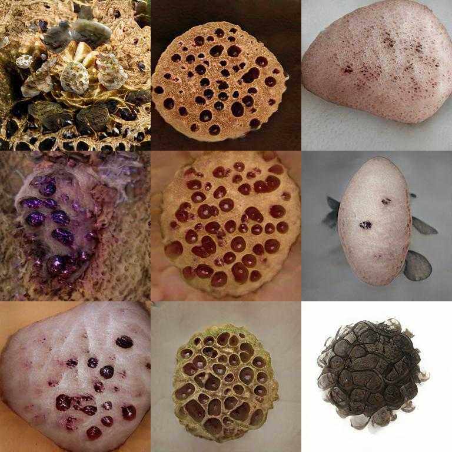
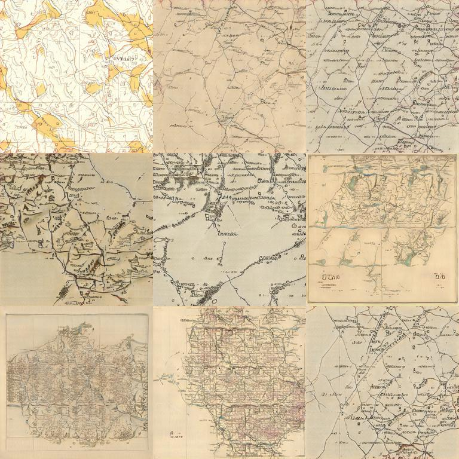
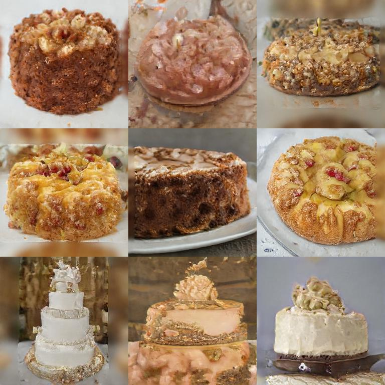
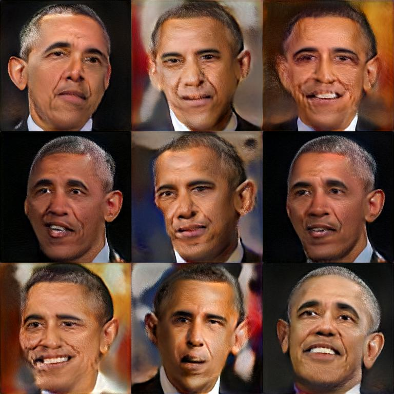
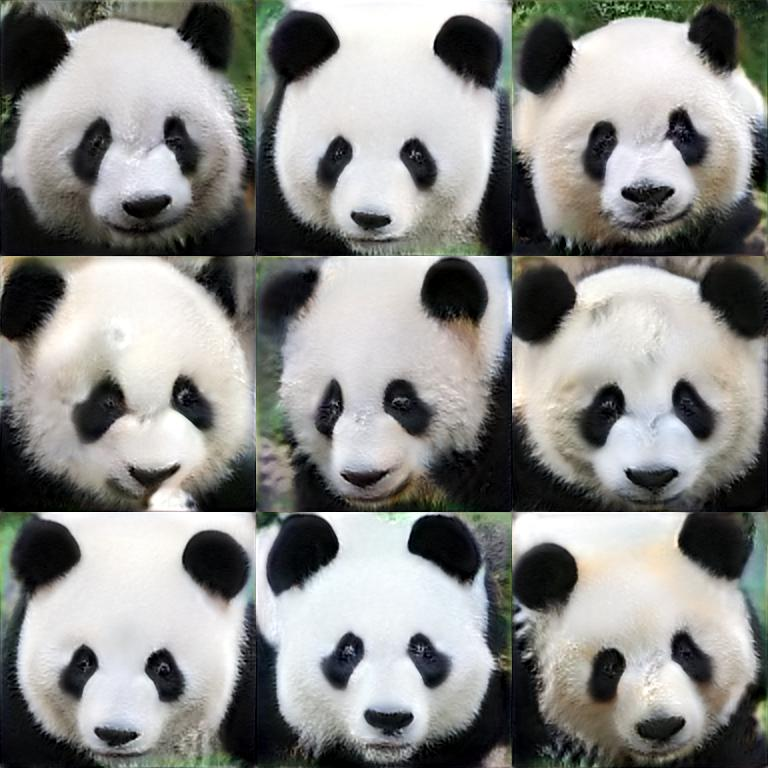

# Awesome Pretrained StyleGAN2

A collection of pre-trained [StyleGAN2](https://github.com/NVlabs/stylegan2) models trained on different datasets at different resolution.

_See [this repo](https://github.com/justinpinkney/awesome-pretrained-stylegan) for pretrained models for StyleGAN 1_

[.jpg)](#car-config-e)
[.jpg)](#car-config-f)

[.jpg)](#faces-FFHQ-config-e)
[.jpg)](#faces-FFHQ-config-e-256x256)
[.jpg)](#faces-FFHQ-config-f)
[.jpg)](#faces-FFHQ-config-f-512x512)

[.jpg)](#faces-FFHQ-slim-256x256)

[.jpg)](#cat-few-shot)
[.jpg)](#dog-few-shot)

If you have a publically accessible model which you know of, or would like to share please see the [contributing](#contributing) section. _Hint: the simplest way to submit a model is to fill in this [form](https://forms.gle/PE1iiTa5tNTdBFYN9)._

### Table of Contents

- Models

    - [car (config-e)](#car-config-e)
    - [car (config-f)](#car-config-f)
    - [cat](#cat)
    - [church](#church)
    - [faces (FFHQ config-e)](#faces-FFHQ-config-e)
    - [faces (FFHQ config-e 256x256)](#faces-FFHQ-config-e-256x256)
    - [faces (FFHQ config-f)](#faces-FFHQ-config-f)
    - [faces (FFHQ config-f 512x512)](#faces-FFHQ-config-f-512x512)
    - [horse](#horse)
    - [Imagenet](#Imagenet)
    - [WikiArt](#WikiArt)
    - [Anime portraits](#Anime-portraits)
    - [microscope images](#microscope-images)
    - [wildlife](#wildlife)
    - [modern art](#modern-art)
    - [trypophobia](#trypophobia)
    - [Abstract art](#Abstract-art)
    - [Maps](#Maps)
    - [cakes](#cakes)
    - [CIFAR 10](#CIFAR-10)
    - [CIFAR 100](#CIFAR-100)
    - [faces (FFHQ slim 256x256)](#faces-FFHQ-slim-256x256)
    - [obama](#obama)
    - [grumpy cat](#grumpy-cat)
    - [panda](#panda)
    - [cat (few shot)](#cat-few-shot)
    - [dog (few shot)](#dog-few-shot)
    - [fursona](#fursona)
    - [my little pony](#my-little-pony)
- [Contributing](#contributing)

## car (config-e)

.jpg)
- Dataset: LSUN Cat
- Resolution: 512x384 config: e
- Author: [NVIDIA]()
- [Download link](http://d36zk2xti64re0.cloudfront.net/stylegan2/networks/stylegan2-car-config-e.pkl)
- StyleGAN2 implementation: https://github.com/NVlabs/stylegan2
- Licence: Nvidia Source Code License-NC
- [Source](https://github.com/NVlabs/stylegan2)

## car (config-f)

.jpg)
- Dataset: LSUN Cat
- Resolution: 512x384 config: f
- Author: [NVIDIA]()
- [Download link](http://d36zk2xti64re0.cloudfront.net/stylegan2/networks/stylegan2-car-config-f.pkl)
- StyleGAN2 implementation: https://github.com/NVlabs/stylegan2
- Licence: Nvidia Source Code License-NC
- [Source](https://github.com/NVlabs/stylegan2)

## cat

- Dataset: LSUN Cat
- Resolution: 256x256 config: f
- Author: [NVIDIA]()
- [Download link](http://d36zk2xti64re0.cloudfront.net/stylegan2/networks/stylegan2-cat-config-f.pkl)
- StyleGAN2 implementation: https://github.com/NVlabs/stylegan2
- Licence: Nvidia Source Code License-NC
- [Source](https://github.com/NVlabs/stylegan2)

## church

- Dataset: LSUN Church
- Resolution: 256x256 config: f
- Author: [NVIDIA]()
- [Download link](http://d36zk2xti64re0.cloudfront.net/stylegan2/networks/stylegan2-church-config-f.pkl)
- StyleGAN2 implementation: https://github.com/NVlabs/stylegan2
- Licence: Nvidia Source Code License-NC
- [Source](https://github.com/NVlabs/stylegan2)

## faces (FFHQ config-e)

.jpg)
- Dataset: FFHQ
- Resolution: 1024x1024 config: e
- Author: [NVIDIA]()
- [Download link](http://d36zk2xti64re0.cloudfront.net/stylegan2/networks/stylegan2-ffhq-config-e.pkl)
- StyleGAN2 implementation: https://github.com/NVlabs/stylegan2
- Licence: Nvidia Source Code License-NC
- [Source](https://github.com/NVlabs/stylegan2)

## faces (FFHQ config-e 256x256)

.jpg)
- Dataset: FFHQ
- Resolution: 256x256 config: e
- Author: [Justin Pinkney](http://justinpinkney.com/)
- [Download link](https://drive.google.com/uc?id=1BUL-RIzXC7Bpnz2cn230CbA4eT7_Etp0)
- StyleGAN2 implementation: https://github.com/justinpinkney/awesome-pretrained-stylegan2/issues/2
- Notes: Trained to FID 11.2 from scratch for 3810 kimg
- Licence: CC BY-NC-SA 4.0
- [Source](https://github.com/justinpinkney/stylegan2)

## faces (FFHQ config-f)

.jpg)
- Dataset: FFHQ
- Resolution: 1024x1024 config: f
- Author: [NVIDIA]()
- [Download link](http://d36zk2xti64re0.cloudfront.net/stylegan2/networks/stylegan2-ffhq-config-f.pkl)
- StyleGAN2 implementation: https://github.com/NVlabs/stylegan2
- Licence: Nvidia Source Code License-NC
- [Source](https://github.com/NVlabs/stylegan2)

## faces (FFHQ config-f 512x512)

.jpg)
- Dataset: FFHQ
- Resolution: 512x512 config: f
- Author: [aydao](https://twitter.com/AydaoGMan)
- [Download link](https://mega.nz/#!eQdHkShY!8wyNKs343L7YUjwXlEg3cWjqK2g2EAIdYz5xbkPy3ng)
- StyleGAN2 implementation: 
- Licence: Public Domain
- [Source](https://twitter.com/AydaoGMan/status/1269689136019116032?s=20)

## horse

- Dataset: LSUN Horse
- Resolution: 256x256 config: f
- Author: [NVIDIA]()
- [Download link](http://d36zk2xti64re0.cloudfront.net/stylegan2/networks/stylegan2-horse-config-f.pkl)
- StyleGAN2 implementation: https://github.com/NVlabs/stylegan2
- Licence: Nvidia Source Code License-NC
- [Source](https://github.com/NVlabs/stylegan2)

## Imagenet

- Dataset: Image net
- Resolution: 512x512 config: Unknown
- Author: [Shawn Presser]()
- [Download link](https://battle.shawwn.com/sdc/stylegan2-imagenet-512/model.ckpt-533504.pkl)
- StyleGAN2 implementation: Unknown
- Notes: Trained using TPUs
- Licence: Unknown
- [Source](https://twitter.com/theshawwn/status/1244081581347598341)

## WikiArt

- Dataset: WikiArt
- Resolution: Unknown config: Unknown
- Author: [Peter Baylies](https://twitter.com/pbaylies)
- [Download link](https://archive.org/download/wikiart-stylegan2-conditional-model/network-snapshot-012052.pkl)
- StyleGAN2 implementation: https://github.com/pbaylies/stylegan2
- Notes: Conditional
- Licence: Unknown
- [Source]()

## Anime portraits

- Dataset: Danboru
- Resolution: 512x512 config: f
- Author: [Aaron Gokaslan](https://skylion007.github.io/)
- [Download link](https://mega.nz/#!PeIi2ayb!xoRtjTXyXuvgDxSsSMn-cOh-Zux9493zqdxwVMaAzp4)
- StyleGAN2 implementation: Unknown
- Licence: Unknown
- [Source](https://www.gwern.net/Faces#stylegan-2)

## microscope images

- Dataset: Unknown
- Resolution: 1024x1024 config: Unknown
- Author: [Michael Friesen](https://twitter.com/MichaelFriese10)
- [Download link](https://mega.nz/#!PbgzWTZT!JbVpqgMU7AOg-sQUoG1BDepuwKtgAsLgjd4YwlTXlpc)
- StyleGAN2 implementation: Unknown
- Licence: Unknown
- [Source](https://twitter.com/MichaelFriese10/status/1230906267960401920?s=20)

## wildlife

- Dataset: Unknown
- Resolution: Unknown config: Unknown
- Author: [Michael Friesen](https://twitter.com/MichaelFriese10)
- [Download link](https://mega.nz/#!rewlECYI!YxVxdCKoeauEbiPKt92otVVHZBOiI-KkZMr0cvKHBdg)
- StyleGAN2 implementation: Unknown
- Licence: Unknown
- [Source](https://twitter.com/MichaelFriese10/status/1215364932088123392?s=20)

## modern art

- Dataset: Unknown
- Resolution: Unknown config: Unknown
- Author: [Michael Friesen](https://twitter.com/MichaelFriese10)
- [Download link](https://mega.nz/#!TCgSVCTa!ZmcV381soxyqiQyHO4p60F5ogoHcaO1PqDF9ZuiHVQw)
- StyleGAN2 implementation: Unknown
- Licence: Unknown
- [Source](https://twitter.com/MichaelFriese10/status/1213697331427545088?s=20)

## trypophobia

- Dataset: https://drive.google.com/file/d/1u_fLHmO6JuJlBTQIKRGgl4PeBKbBu9GJ/view
- Resolution: 1024x1024 config: f
- Author: [Sid Black](https://twitter.com/realmeatyhuman)
- [Download link](https://drive.google.com/uc?id=12yYXZymadSIj74Yue1Q7RrlbIqrXggo3)
- StyleGAN2 implementation: https://github.com/NVlabs/stylegan2
- Licence: Nvidia Source Code License-NC
- [Source](https://twitter.com/realmeatyhuman/status/1255240894049067008)

## Abstract art

- Dataset: Frea Buckler artwork
- Resolution: 1024x1024 config: f
- Author: [Derrick Schultz](https://twitter.com/dvsch)
- [Download link](https://drive.google.com/uc?id=1YzZemZAp7BVW701_BZ7uabJWJJaS2g7v)
- StyleGAN2 implementation: RunwayML
- Notes: Based on Frea Buckler’s artwork from her Instagram account (purposefully undertrained to be abstract and not infringe on the artist’s own work)
- Licence: Unknown
- [Source](https://twitter.com/dvsch/status/1255885874560225284?s=20)

## Maps

- Dataset: Maps
- Resolution: 1024x1024 config: f
- Author: [Topi Tjukanov](https://tjukanov.org/)
- [Download link](https://archive.org/download/mapdreamer/mapdreamer.pkl)
- StyleGAN2 implementation: https://github.com/NVlabs/stylegan2
- Licence: Unknown
- [Source](https://medium.com/@tjukanov/mapdreamer-ai-cartography-4f2f6a40ef55)

## cakes

- Dataset: Internet scraped cakes
- Resolution: 256x256 config: e
- Author: [Justin Pinkney](https://www.justinpinkney.com)
- [Download link](https://drive.google.com/uc?id=13dTNlKDlgcIsCaPxMqX7luYqOo-lwPwk)
- StyleGAN2 implementation: https://github.com/justinpinkney/stylegan2
- Notes: Trained from scratch to FID 13.6
- Licence: CC BY-NC-SA 4.0
- [Source](https://www.justinpinkney.com/cake-gan)

## CIFAR 10

- Dataset: CIFAR 10
- Resolution: TBC config: see paper
- Author: [mit-han-lab](https://hanlab.mit.edu/)
- [Download link](https://hanlab.mit.edu/projects/data-efficient-gans/models/DiffAugment-stylegan2-cifar10.pkl)
- StyleGAN2 implementation: https://github.com/mit-han-lab/data-efficient-gans/tree/master/DiffAugment-stylegan2
- Notes: Trained with DiffAugment, FID (10k) = 9.89
- Licence: Unknown
- [Source](https://hanlab.mit.edu/projects/data-efficient-gans/)

## CIFAR 100

- Dataset: CIFAR 100
- Resolution: 256x256 config: see paper
- Author: [mit-han-lab](https://hanlab.mit.edu/)
- [Download link](https://hanlab.mit.edu/projects/data-efficient-gans/models/DiffAugment-stylegan2-cifar100.pkl)
- StyleGAN2 implementation: https://github.com/mit-han-lab/data-efficient-gans/tree/master/DiffAugment-stylegan2
- Notes: Trained with DiffAugment, FID (10k) = 15.22
- Licence: Unknown
- [Source](https://hanlab.mit.edu/projects/data-efficient-gans/)

## faces (FFHQ slim 256x256)

.jpg)
- Dataset: FFHQ
- Resolution: 256x256 config: slim
- Author: [mit-han-lab](https://hanlab.mit.edu/)
- [Download link](https://hanlab.mit.edu/projects/data-efficient-gans/models/stylegan2-ffhq.pkl)
- StyleGAN2 implementation: https://github.com/mit-han-lab/data-efficient-gans/tree/master/DiffAugment-stylegan2
- Notes: Trained with DiffAugment, FID = 3.81
- Licence: Unknown
- [Source](https://hanlab.mit.edu/projects/data-efficient-gans/)

## obama

- Dataset: 100 images of Barack Obama
- Resolution: 256x256 config: f
- Author: [mit-han-lab](https://hanlab.mit.edu/)
- [Download link](https://hanlab.mit.edu/projects/data-efficient-gans/models/stylegan2-100-shot-obama.pkl)
- StyleGAN2 implementation: https://github.com/mit-han-lab/data-efficient-gans/tree/master/DiffAugment-stylegan2
- Notes: Trained with DiffAugment, FID (5k) = 46.87
- Licence: Unknown
- [Source](https://hanlab.mit.edu/projects/data-efficient-gans/)

## grumpy cat

- Dataset: 100 images of Grumpy Cats
- Resolution: 256x256 config: f
- Author: [mit-han-lab](https://hanlab.mit.edu/)
- [Download link](https://hanlab.mit.edu/projects/data-efficient-gans/models/stylegan2-100-shot-grumpy_cat.pkl)
- StyleGAN2 implementation: https://github.com/mit-han-lab/data-efficient-gans/tree/master/DiffAugment-stylegan2
- Notes: Trained with DiffAugment, FID (5k) = 27.08
- Licence: Unknown
- [Source](https://hanlab.mit.edu/projects/data-efficient-gans/)

## panda

- Dataset: 100 images of pandas
- Resolution: 256x256 config: f
- Author: [mit-han-lab](https://hanlab.mit.edu/)
- [Download link](https://hanlab.mit.edu/projects/data-efficient-gans/models/stylegan2-100-shot-panda.pkl)
- StyleGAN2 implementation: https://github.com/mit-han-lab/data-efficient-gans/tree/master/DiffAugment-stylegan2
- Notes: Trained with DiffAugment, FID (5k) = 12.06
- Licence: Unknown
- [Source](https://hanlab.mit.edu/projects/data-efficient-gans/)

## cat (few shot)

.jpg)
- Dataset: [AnimalFace](https://vcla.stat.ucla.edu/people/zhangzhang-si/HiT/exp5.html)
- Resolution: 256x256 config: f
- Author: [mit-han-lab](https://hanlab.mit.edu/)
- [Download link](https://hanlab.mit.edu/projects/data-efficient-gans/models/stylegan2-AnimalFace-cat.pkl)
- StyleGAN2 implementation: https://github.com/mit-han-lab/data-efficient-gans/tree/master/DiffAugment-stylegan2
- Notes: Trained with DiffAugment, FID (5k) = 42.44
- Licence: Unknown
- [Source](https://hanlab.mit.edu/projects/data-efficient-gans/)

## dog (few shot)

.jpg)
- Dataset: [AnimalFace](https://vcla.stat.ucla.edu/people/zhangzhang-si/HiT/exp5.html)
- Resolution: 256x256 config: f
- Author: [mit-han-lab](https://hanlab.mit.edu/)
- [Download link](https://hanlab.mit.edu/projects/data-efficient-gans/models/stylegan2-AnimalFace-dog.pkl)
- StyleGAN2 implementation: https://github.com/mit-han-lab/data-efficient-gans/tree/master/DiffAugment-stylegan2
- Notes: Trained with DiffAugment, FID (5k) = 58.85
- Licence: Unknown
- [Source](https://hanlab.mit.edu/projects/data-efficient-gans/)

## fursona

- Dataset: ~55k SFW images from e621.net
- Resolution: 256x256 config: TBC
- Author: [arfa](https://twitter.com/arfafax)
- [Download link](https://thisfursonadoesnotexist.com/model/network-e621-r-512-3194880.pkl)
- StyleGAN2 implementation: Unknown
- Notes: Trained using TPUs
- Licence: Unknown
- [Source](https://thisfursonadoesnotexist.com/)

## my little pony

- Dataset: ~104k SFW images from Derpibooru
- Resolution: 1024x1024 config: TBC
- Author: [arfa](https://twitter.com/arfafax)
- [Download link](https://thisponydoesnotexist.net/model/network-ponies-1024-151552.pkl)
- StyleGAN2 implementation: Unknown
- Notes: Trained using TPUs
- Licence: Unknown
- [Source](https://thisponydoesnotexist.net/)

## Contributing

__TLDR: You can either edit the [models.json](models.json) file or fill out this [form](https://forms.gle/PE1iiTa5tNTdBFYN9).__

This readme is automatically generated using Jinja, please do not try and edit it directly. Information about the models is stored in `models.json` please add your model to this file. Preview images are generated automatically and the process is used to test the link so please only edit the json file.