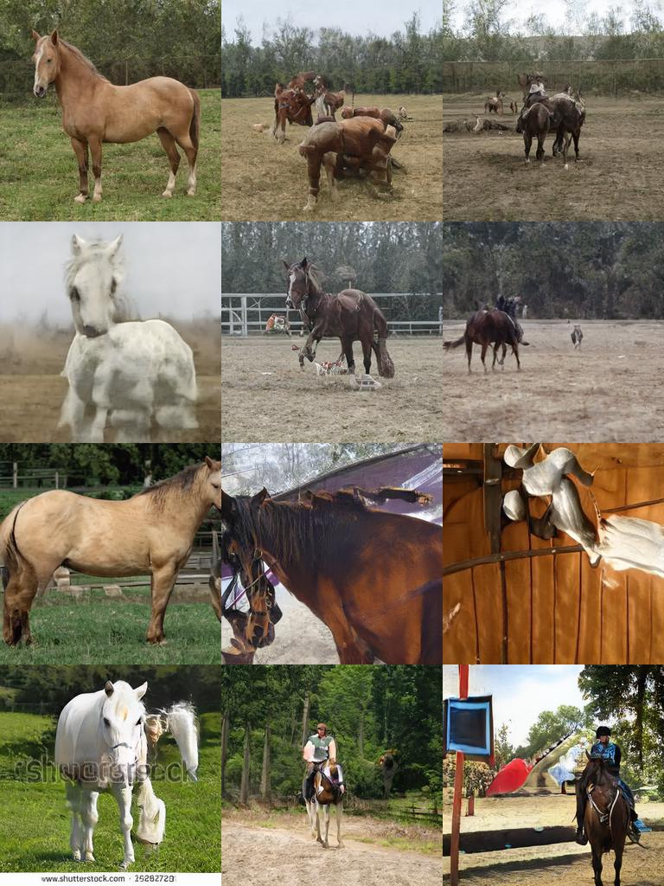

# Awesome Pretrained StyleGAN2

A collection of pre-trained [StyleGAN2](https://github.com/NVlabs/stylegan2) models trained on different datasets at different resolution.

_See [this repo](https://github.com/justinpinkney/awesome-pretrained-stylegan) for pretrained models for StyleGAN 1_

[/thumbnail.jpg)](#car-config-e)
[/thumbnail.jpg)](#car-config-f)

[/thumbnail.jpg)](#faces-FFHQ-config-e)
[/thumbnail.jpg)](#faces-FFHQ-config-e-256x256)
[/thumbnail.jpg)](#faces-FFHQ-config-f)
[/thumbnail.jpg)](#faces-FFHQ-config-f-512x512)

[/thumbnail.jpg)](#faces-FFHQ-slim-256x256)

If you have a publically accessible model which you know of, or would like to share please see the [contributing](#contributing) section. _Hint: the simplest way to submit a model is to fill in this [form](https://forms.gle/PE1iiTa5tNTdBFYN9)._

### Table of Contents

- Models

    - [car (config-e)](#car-config-e)
    - [car (config-f)](#car-config-f)
    - [cat](#cat)
    - [church](#church)
    - [faces (FFHQ config-e)](#faces-FFHQ-config-e)
    - [faces (FFHQ config-e 256x256)](#faces-FFHQ-config-e-256x256)
    - [faces (FFHQ config-f)](#faces-FFHQ-config-f)
    - [faces (FFHQ config-f 512x512)](#faces-FFHQ-config-f-512x512)
    - [horse](#horse)
    - [Imagenet](#Imagenet)
    - [WikiArt](#WikiArt)
    - [Anime portraits](#Anime-portraits)
    - [microscope images](#microscope-images)
    - [wildlife](#wildlife)
    - [modern art](#modern-art)
    - [trypophobia](#trypophobia)
    - [Abstract art](#Abstract-art)
    - [Maps](#Maps)
    - [cakes](#cakes)
    - [CIFAR 10](#CIFAR-10)
    - [CIFAR 100](#CIFAR-100)
    - [faces (FFHQ slim 256x256)](#faces-FFHQ-slim-256x256)
    - [obama](#obama)
    - [grumpy cat](#grumpy-cat)
    - [panda](#panda)
    - [fursona](#fursona)
    - [my little pony](#my-little-pony)
    - [painting faces](#painting-faces)
    - [ukiyoe faces](#ukiyoe-faces)
- [Notes](#notes)
- [Contributing](#contributing)

## car (config-e)

/samples.jpg)
- [Style mixing example](content/car%20(config-e)/mixing.jpg), [interpolation video](content/car%20(config-e)/interpolation.mp4)
- Dataset: LSUN Car
- Resolution: 512x512 config: e
- Author: [NVIDIA]()
- [Download link](http://d36zk2xti64re0.cloudfront.net/stylegan2/networks/stylegan2-car-config-e.pkl)
- StyleGAN2 implementation: https://github.com/NVlabs/stylegan2
- Licence: Nvidia Source Code License-NC
- [Source](https://github.com/NVlabs/stylegan2)

## car (config-f)

/samples.jpg)
- [Style mixing example](content/car%20(config-f)/mixing.jpg), [interpolation video](content/car%20(config-f)/interpolation.mp4)
- Dataset: LSUN Car
- Resolution: 512x512 config: f
- Author: [NVIDIA]()
- [Download link](http://d36zk2xti64re0.cloudfront.net/stylegan2/networks/stylegan2-car-config-f.pkl)
- StyleGAN2 implementation: https://github.com/NVlabs/stylegan2
- Licence: Nvidia Source Code License-NC
- [Source](https://github.com/NVlabs/stylegan2)

## cat

- [Style mixing example](content/cat/mixing.jpg), [interpolation video](content/cat/interpolation.mp4)
- Dataset: LSUN Cat
- Resolution: 256x256 config: f
- Author: [NVIDIA]()
- [Download link](http://d36zk2xti64re0.cloudfront.net/stylegan2/networks/stylegan2-cat-config-f.pkl)
- StyleGAN2 implementation: https://github.com/NVlabs/stylegan2
- Licence: Nvidia Source Code License-NC
- [Source](https://github.com/NVlabs/stylegan2)

## church

- [Style mixing example](content/church/mixing.jpg), [interpolation video](content/church/interpolation.mp4)
- Dataset: LSUN Church
- Resolution: 256x256 config: f
- Author: [NVIDIA]()
- [Download link](http://d36zk2xti64re0.cloudfront.net/stylegan2/networks/stylegan2-church-config-f.pkl)
- StyleGAN2 implementation: https://github.com/NVlabs/stylegan2
- Licence: Nvidia Source Code License-NC
- [Source](https://github.com/NVlabs/stylegan2)

## faces (FFHQ config-e)

/samples.jpg)
- [Style mixing example](content/faces%20(FFHQ%20config-e)/mixing.jpg), [interpolation video](content/faces%20(FFHQ%20config-e)/interpolation.mp4)
- Dataset: FFHQ
- Resolution: 1024x1024 config: e
- Author: [NVIDIA]()
- [Download link](http://d36zk2xti64re0.cloudfront.net/stylegan2/networks/stylegan2-ffhq-config-e.pkl)
- StyleGAN2 implementation: https://github.com/NVlabs/stylegan2
- Licence: Nvidia Source Code License-NC
- [Source](https://github.com/NVlabs/stylegan2)

## faces (FFHQ config-e 256x256)

/samples.jpg)
- [Style mixing example](content/faces%20(FFHQ%20config-e%20256x256)/mixing.jpg), [interpolation video](content/faces%20(FFHQ%20config-e%20256x256)/interpolation.mp4)
- Dataset: FFHQ
- Resolution: 256x256 config: e
- Author: [Justin Pinkney](http://justinpinkney.com/)
- [Download link](https://drive.google.com/uc?id=1BUL-RIzXC7Bpnz2cn230CbA4eT7_Etp0)
- StyleGAN2 implementation: https://github.com/justinpinkney/stylegan2
- Notes: Trained to FID 11.2 from scratch for 3810 kimg
- Licence: CC BY-NC-SA 4.0
- [Source](https://github.com/justinpinkney/awesome-pretrained-stylegan2/issues/2)

## faces (FFHQ config-f)

/samples.jpg)
- [Style mixing example](content/faces%20(FFHQ%20config-f)/mixing.jpg), [interpolation video](content/faces%20(FFHQ%20config-f)/interpolation.mp4)
- Dataset: FFHQ
- Resolution: 1024x1024 config: f
- Author: [NVIDIA]()
- [Download link](http://d36zk2xti64re0.cloudfront.net/stylegan2/networks/stylegan2-ffhq-config-f.pkl)
- StyleGAN2 implementation: https://github.com/NVlabs/stylegan2
- Licence: Nvidia Source Code License-NC
- [Source](https://github.com/NVlabs/stylegan2)

## faces (FFHQ config-f 512x512)

/samples.jpg)
- [Style mixing example](content/faces%20(FFHQ%20config-f%20512x512)/mixing.jpg), [interpolation video](content/faces%20(FFHQ%20config-f%20512x512)/interpolation.mp4)
- Dataset: FFHQ
- Resolution: 512x512 config: f
- Author: [aydao](https://twitter.com/AydaoGMan)
- [Download link](https://mega.nz/#!eQdHkShY!8wyNKs343L7YUjwXlEg3cWjqK2g2EAIdYz5xbkPy3ng)
- StyleGAN2 implementation: 
- Licence: Public Domain
- [Source](https://twitter.com/AydaoGMan/status/1269689136019116032?s=20)

## horse

- [Style mixing example](content/horse/mixing.jpg), [interpolation video](content/horse/interpolation.mp4)
- Dataset: LSUN Horse
- Resolution: 256x256 config: f
- Author: [NVIDIA]()
- [Download link](http://d36zk2xti64re0.cloudfront.net/stylegan2/networks/stylegan2-horse-config-f.pkl)
- StyleGAN2 implementation: https://github.com/NVlabs/stylegan2
- Licence: Nvidia Source Code License-NC
- [Source](https://github.com/NVlabs/stylegan2)

## Imagenet

- [Style mixing example](content/Imagenet/mixing.jpg), [interpolation video](content/Imagenet/interpolation.mp4)
- Dataset: Image net
- Resolution: 512x512 config: Unknown
- Author: [Shawn Presser]()
- [Download link](https://battle.shawwn.com/sdc/stylegan2-imagenet-512/model.ckpt-533504.pkl)
- StyleGAN2 implementation: Unknown
- Notes: Trained using TPUs
- Licence: Unknown
- [Source](https://twitter.com/theshawwn/status/1244081581347598341)

## WikiArt

- [Style mixing example](content/WikiArt/mixing.jpg), [interpolation video](content/WikiArt/interpolation.mp4)
- Dataset: WikiArt
- Resolution: Unknown config: Unknown
- Author: [Peter Baylies](https://twitter.com/pbaylies)
- [Download link](https://archive.org/download/wikiart-stylegan2-conditional-model/network-snapshot-012052.pkl)
- StyleGAN2 implementation: https://github.com/pbaylies/stylegan2
- Notes: Conditional
- Licence: Unknown
- [Source]()

## Anime portraits

- [Style mixing example](content/Anime%20portraits/mixing.jpg), [interpolation video](content/Anime%20portraits/interpolation.mp4)
- Dataset: Danboru
- Resolution: 512x512 config: f
- Author: [Aaron Gokaslan](https://skylion007.github.io/)
- [Download link](https://mega.nz/#!PeIi2ayb!xoRtjTXyXuvgDxSsSMn-cOh-Zux9493zqdxwVMaAzp4)
- StyleGAN2 implementation: Unknown
- Licence: Unknown
- [Source](https://www.gwern.net/Faces#stylegan-2)

## microscope images

- [Style mixing example](content/microscope%20images/mixing.jpg), [interpolation video](content/microscope%20images/interpolation.mp4)
- Dataset: Unknown
- Resolution: 512x512 config: Unknown
- Author: [Michael Friesen](https://twitter.com/MichaelFriese10)
- [Download link](https://mega.nz/#!PbgzWTZT!JbVpqgMU7AOg-sQUoG1BDepuwKtgAsLgjd4YwlTXlpc)
- StyleGAN2 implementation: Unknown
- Licence: Unknown
- [Source](https://twitter.com/MichaelFriese10/status/1230906267960401920?s=20)

## wildlife

- [Style mixing example](content/wildlife/mixing.jpg), [interpolation video](content/wildlife/interpolation.mp4)
- Dataset: Unknown
- Resolution: Unknown config: Unknown
- Author: [Michael Friesen](https://twitter.com/MichaelFriese10)
- [Download link](https://mega.nz/#!rewlECYI!YxVxdCKoeauEbiPKt92otVVHZBOiI-KkZMr0cvKHBdg)
- StyleGAN2 implementation: Unknown
- Licence: Unknown
- [Source](https://twitter.com/MichaelFriese10/status/1215364932088123392?s=20)

## modern art

- [Style mixing example](content/modern%20art/mixing.jpg), [interpolation video](content/modern%20art/interpolation.mp4)
- Dataset: Unknown
- Resolution: Unknown config: Unknown
- Author: [Michael Friesen](https://twitter.com/MichaelFriese10)
- [Download link](https://mega.nz/#!TCgSVCTa!ZmcV381soxyqiQyHO4p60F5ogoHcaO1PqDF9ZuiHVQw)
- StyleGAN2 implementation: Unknown
- Licence: Unknown
- [Source](https://twitter.com/MichaelFriese10/status/1213697331427545088?s=20)

## trypophobia

- [Style mixing example](content/trypophobia/mixing.jpg), [interpolation video](content/trypophobia/interpolation.mp4)
- Dataset: https://drive.google.com/file/d/1u_fLHmO6JuJlBTQIKRGgl4PeBKbBu9GJ/view
- Resolution: 1024x1024 config: f
- Author: [Sid Black](https://twitter.com/realmeatyhuman)
- [Download link](https://drive.google.com/uc?id=12yYXZymadSIj74Yue1Q7RrlbIqrXggo3)
- StyleGAN2 implementation: https://github.com/NVlabs/stylegan2
- Licence: Nvidia Source Code License-NC
- [Source](https://twitter.com/realmeatyhuman/status/1255240894049067008)

## Abstract art

- [Style mixing example](content/Abstract%20art/mixing.jpg), [interpolation video](content/Abstract%20art/interpolation.mp4)
- Dataset: Frea Buckler artwork
- Resolution: 1024x1024 config: f
- Author: [Derrick Schultz](https://twitter.com/dvsch)
- [Download link](https://drive.google.com/uc?id=1YzZemZAp7BVW701_BZ7uabJWJJaS2g7v)
- StyleGAN2 implementation: RunwayML
- Notes: Based on Frea Buckler’s artwork from her Instagram account (purposefully undertrained to be abstract and not infringe on the artist’s own work)
- Licence: Unknown
- [Source](https://twitter.com/dvsch/status/1255885874560225284?s=20)

## Maps

- [Style mixing example](content/Maps/mixing.jpg), [interpolation video](content/Maps/interpolation.mp4)
- Dataset: Maps
- Resolution: 1024x1024 config: f
- Author: [Topi Tjukanov](https://tjukanov.org/)
- [Download link](https://archive.org/download/mapdreamer/mapdreamer.pkl)
- StyleGAN2 implementation: https://github.com/NVlabs/stylegan2
- Licence: Unknown
- [Source](https://medium.com/@tjukanov/mapdreamer-ai-cartography-4f2f6a40ef55)

## cakes

- [Style mixing example](content/cakes/mixing.jpg), [interpolation video](content/cakes/interpolation.mp4)
- Dataset: Internet scraped cakes
- Resolution: 256x256 config: e
- Author: [Justin Pinkney](https://www.justinpinkney.com)
- [Download link](https://drive.google.com/uc?id=13dTNlKDlgcIsCaPxMqX7luYqOo-lwPwk)
- StyleGAN2 implementation: https://github.com/justinpinkney/stylegan2
- Notes: Trained from scratch to FID 13.6
- Licence: CC BY-NC-SA 4.0
- [Source](https://www.justinpinkney.com/cake-gan)

## CIFAR 10

- [Style mixing example](content/CIFAR%2010/mixing.jpg), [interpolation video](content/CIFAR%2010/interpolation.mp4)
- Dataset: CIFAR 10
- Resolution: 32x32 config: see paper
- Author: [mit-han-lab](https://hanlab.mit.edu/)
- [Download link](https://hanlab.mit.edu/projects/data-efficient-gans/models/DiffAugment-stylegan2-cifar10.pkl)
- StyleGAN2 implementation: https://github.com/mit-han-lab/data-efficient-gans/tree/master/DiffAugment-stylegan2
- Notes: Trained with DiffAugment, FID (10k) = 9.89
- Licence: Unknown
- [Source](https://hanlab.mit.edu/projects/data-efficient-gans/)

## CIFAR 100

- [Style mixing example](content/CIFAR%20100/mixing.jpg), [interpolation video](content/CIFAR%20100/interpolation.mp4)
- Dataset: CIFAR 100
- Resolution: 32x32 config: see paper
- Author: [mit-han-lab](https://hanlab.mit.edu/)
- [Download link](https://hanlab.mit.edu/projects/data-efficient-gans/models/DiffAugment-stylegan2-cifar100.pkl)
- StyleGAN2 implementation: https://github.com/mit-han-lab/data-efficient-gans/tree/master/DiffAugment-stylegan2
- Notes: Trained with DiffAugment, FID (10k) = 15.22
- Licence: Unknown
- [Source](https://hanlab.mit.edu/projects/data-efficient-gans/)

## faces (FFHQ slim 256x256)

/samples.jpg)
- [Style mixing example](content/faces%20(FFHQ%20slim%20256x256)/mixing.jpg), [interpolation video](content/faces%20(FFHQ%20slim%20256x256)/interpolation.mp4)
- Dataset: FFHQ
- Resolution: 256x256 config: slim
- Author: [mit-han-lab](https://hanlab.mit.edu/)
- [Download link](https://hanlab.mit.edu/projects/data-efficient-gans/models/stylegan2-ffhq.pkl)
- StyleGAN2 implementation: https://github.com/mit-han-lab/data-efficient-gans/tree/master/DiffAugment-stylegan2
- Notes: Trained with DiffAugment, FID = 3.81
- Licence: Unknown
- [Source](https://hanlab.mit.edu/projects/data-efficient-gans/)

## obama

- [Style mixing example](content/obama/mixing.jpg), [interpolation video](content/obama/interpolation.mp4)
- Dataset: 100 images of Barack Obama
- Resolution: 256x256 config: f
- Author: [mit-han-lab](https://hanlab.mit.edu/)
- [Download link](https://hanlab.mit.edu/projects/data-efficient-gans/models/stylegan2-100-shot-obama.pkl)
- StyleGAN2 implementation: https://github.com/mit-han-lab/data-efficient-gans/tree/master/DiffAugment-stylegan2
- Notes: Trained with DiffAugment, FID (5k) = 46.87
- Licence: Unknown
- [Source](https://hanlab.mit.edu/projects/data-efficient-gans/)

## grumpy cat

- [Style mixing example](content/grumpy%20cat/mixing.jpg), [interpolation video](content/grumpy%20cat/interpolation.mp4)
- Dataset: 100 images of Grumpy Cats
- Resolution: 256x256 config: f
- Author: [mit-han-lab](https://hanlab.mit.edu/)
- [Download link](https://hanlab.mit.edu/projects/data-efficient-gans/models/stylegan2-100-shot-grumpy_cat.pkl)
- StyleGAN2 implementation: https://github.com/mit-han-lab/data-efficient-gans/tree/master/DiffAugment-stylegan2
- Notes: Trained with DiffAugment, FID (5k) = 27.08
- Licence: Unknown
- [Source](https://hanlab.mit.edu/projects/data-efficient-gans/)

## panda

- [Style mixing example](content/panda/mixing.jpg), [interpolation video](content/panda/interpolation.mp4)
- Dataset: 100 images of pandas
- Resolution: 256x256 config: f
- Author: [mit-han-lab](https://hanlab.mit.edu/)
- [Download link](https://hanlab.mit.edu/projects/data-efficient-gans/models/stylegan2-100-shot-panda.pkl)
- StyleGAN2 implementation: https://github.com/mit-han-lab/data-efficient-gans/tree/master/DiffAugment-stylegan2
- Notes: Trained with DiffAugment, FID (5k) = 12.06
- Licence: Unknown
- [Source](https://hanlab.mit.edu/projects/data-efficient-gans/)

## fursona

- [Style mixing example](content/fursona/mixing.jpg), [interpolation video](content/fursona/interpolation.mp4)
- Dataset: ~55k SFW images from e621.net
- Resolution: 512x512 config: TBC
- Author: [arfa](https://twitter.com/arfafax)
- [Download link](https://thisfursonadoesnotexist.com/model/network-e621-r-512-3194880.pkl)
- StyleGAN2 implementation: Unknown
- Notes: Trained using TPUs
- Licence: Unknown
- [Source](https://thisfursonadoesnotexist.com/)

## my little pony

- [Style mixing example](content/my%20little%20pony/mixing.jpg), [interpolation video](content/my%20little%20pony/interpolation.mp4)
- Dataset: ~104k SFW images from Derpibooru
- Resolution: 1024x1024 config: TBC
- Author: [arfa](https://twitter.com/arfafax)
- [Download link](https://thisponydoesnotexist.net/model/network-ponies-1024-151552.pkl)
- StyleGAN2 implementation: Unknown
- Notes: Trained using TPUs
- Licence: Unknown
- [Source](https://thisponydoesnotexist.net/)

## painting faces

- [Style mixing example](content/painting%20faces/mixing.jpg), [interpolation video](content/painting%20faces/interpolation.mp4)
- Dataset: MetFaces
- Resolution: 1024x1024 config: f
- Author: [AK](https://twitter.com/ak92501)
- [Download link](https://drive.google.com/uc?id=1H-MYFZqngF1R0whm4bc3fEoX7VvOWaDl)
- StyleGAN2 implementation: Unknown
- Licence: Unknown
- [Source](https://twitter.com/ak92501/status/1282466682267676675?s=20)

## ukiyoe faces

- [Style mixing example](content/ukiyoe%20faces/mixing.jpg), [interpolation video](content/ukiyoe%20faces/interpolation.mp4)
- Dataset: 5000 faces aligned and detected from ukiyoe images
- Resolution: 256x256 config: slim
- Author: [Justin Pinkney](https://www.justinpinkney.com)
- [Download link](https://drive.google.com/uc?id=1_QysUKfed1-_x9e5off2WWJKp1yUcidu)
- StyleGAN2 implementation: https://github.com/justinpinkney/data-efficient-gans/
- Notes: Fine tuned from ffhq-256-slim, used DiffAugment for training, FID = 12.74
- Licence: CC BY-NC-SA 4.0
- [Source]()

## Notes

- The configuration "slim" refers to the reduced feature map model used in the Karras limited data and Zhao data efficient papers.
- Each row in the sample grids above use a different level of trunction: 0.25, 0.5, 0.75, 1 from top to bottom.
- Style mixing figure and interpolation video generated using truncation of 0.75

## Contributing

__TLDR: You can either edit the [models.json](models.json) file or fill out this [form](https://forms.gle/PE1iiTa5tNTdBFYN9).__

This readme is automatically generated using Jinja, please do not try and edit it directly. Information about the models is stored in `models.json` please add your model to this file. Preview images are generated automatically and the process is used to test the link so please only edit the json file.